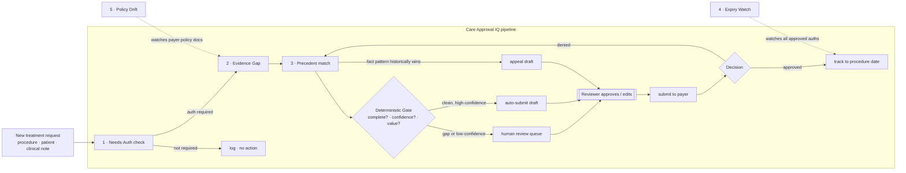

# Care Approval IQ — Architecture & Design

**Zynara Health** · Microsoft Agent-a-thon 2026 · Architect track
_Design of record. Companion: `TDD.md` (implementation-level), `DECISIONS.md`
(deltas), `../progress/STATUS.md` (build state)._

---

## 1. One line

A five-agent system that gets a clinician's treatment request **approved by the
insurer on the first pass**, and **drafts the winning appeal** when it isn't —
with a human approving every outbound action.

## 2. The business problem

Before a clinician can deliver many treatments — an MRI, a specialist referral,
a course of physiotherapy, surgery — the patient's insurer must authorise it
in advance ("prior authorisation" / "pre-authorisation"). The process is
manual, slow, and error-prone:

| Evidence | Source |
|---|---|
| US hospitals spend **$687B/yr on administration** vs **$346B on direct patient care** | Sully.ai / health-system cost studies, 2026 |
| Prior auth is named the **single largest automatable cost centre** in health-system admin | ditto |
| Only **11.5%** of denied requests are appealed | AMA, 2026 |
| **80.7%** of appeals succeed (Medicare Advantage; 95% for skilled-nursing) | HHS OIG, KFF, 2026 |
| **62%** of physicians don't appeal — *because they believe, wrongly, that they'll lose* | AMA prior-auth survey |
| Common denial causes: **missing pre-auth, wrong procedure code, incomplete clinical information, lapsed cover** | Bupa / AXA claims guidance (UK), 2026 |

The core insight the product is built on: **the outcome of every past request is
a recorded fact.** Approval and denial reasons are logged. So the system's
recommendations are grounded in evidence, not estimation — the failure mode that
sinks most "AI for public admin" ideas (predicting what you cannot measure) does
not apply here.

**Regulatory tailwind:** the US CMS-0057-F rule forces payers to expose four
FHIR APIs and publicly report prior-auth metrics on a 2027 timeline — the
multi-system integration surface this design assumes is being mandated into
existence. The UK equivalent (Bupa/AXA pre-authorisation, Financial Ombudsman
Service appeals) already exists. **The system is payer-agnostic by design** (see
§9).

## 3. Intended users

| User | What they get |
|---|---|
| **Clinic / hospital billing & pre-auth teams** (primary) | A request assembled, gap-checked, and submitted; denials triaged and appeals drafted |
| **Clinicians** (secondary) | Fewer forms; a one-line "this will be approved / here's the one thing missing" |
| **Practice managers** | A dashboard: what's pending, what's at risk of expiry, £ recovered via appeals |

## 4. Solution overview

One request flows through a deterministic pipeline; specialised agents do the
reasoning at each step; a human approves anything that leaves the building.



## 5. The five agents

Each agent has a **distinct kind of reasoning**, not a distinct topic. All five
serve every procedure type and both regions.

### 5.1 Needs-Auth check
- **Responsibility:** does *this payer + plan* require prior authorisation for
  *this procedure* as of today? Return the required procedure/CCSD code and the
  policy reference.
- **Why it can't merge:** payer rule sets differ per plan and change monthly;
  getting this wrong means wasted work or an automatic denial.
- **Tools / data:** payer rule-set knowledge base (`data/policies/`), procedure
  code lookup. Mostly deterministic; agent reasons over ambiguous plan language.
- **In → out:** request → `{ authRequired, code, policyRef, region }`.

### 5.2 Evidence Gap
- **Responsibility:** read the unstructured clinical note against the payer's
  written approval criteria for this procedure; list what's **documented**, what's
  **missing**, and what's **contradictory**.
- **Why it can't merge:** this is deep language comprehension over messy free
  text vs. a structured rubric — the hardest task, and the one humans are slowest
  at (scrolling notes for "conservative treatment tried, and for how long").
- **Tools / data:** the payer's criteria for the procedure (File Search over
  `data/policies/`), the patient's clinical note.
- **In → out:** request + criteria → `{ met[], missing[], conflicts[], readiness }`.

### 5.3 Precedent match  *(the differentiator)*
- **Responsibility:** find past submissions with a similar fact pattern; report
  their recorded outcomes; recommend **submit / strengthen / appeal**; when a
  denial has occurred, **draft the appeal** citing the specific policy clause
  misapplied and the precedent cases.
- **Why it can't merge:** operates on the *corpus of past outcomes*, a different
  altitude from the single case in front of it. This is where the 62%-wrong-belief
  problem is solved — with recorded fact, not a hunch.
- **Tools / data:** the outcomes store (`Submissions` + `Outcomes` tables),
  fact-pattern similarity match (deterministic), the payer policy text.
- **In → out:** case + gap report → `{ precedents[], recommendation, appealDraft? }`.

### 5.4 Expiry Watch  *(runs continuously)*
- **Responsibility:** every approved authorisation has a validity window. Flag any
  where the window will close before the procedure is scheduled — forcing a
  full re-submission.
- **Why it can't merge:** cross-system (auth record ⇄ scheduling), invisible until
  it bites, entirely preventable, and nobody watches it by hand.
- **Tools / data:** the auth record, the scheduling feed; deterministic date math,
  agent-narrated alert.
- **In → out:** approved auths → `EarlyWarning{ authId, expiresAt, procedureDate, daysOfMargin }`.

### 5.5 Policy Drift  *(runs continuously)*
- **Responsibility:** watch each payer's published policy documents; when criteria
  change, identify which in-flight or template requests now fail, and draft the
  delta.
- **Why it can't merge:** diffing regulatory/policy prose against a body of
  existing templates is genuinely impossible to do manually at any scale.
- **Tools / data:** versioned payer policy documents; deterministic diff, agent
  explains the operational impact.
- **In → out:** new policy version → `DriftAlert{ payer, procedure, changedCriterion, affectedTemplates[] }`.

## 6. Why multi-agent, not one agent

1. **Different reasoning modes.** Rule lookup, free-text comprehension against a
   rubric, corpus-level pattern matching, date arithmetic, and document diffing
   are not one skill. A single prompt doing all five is worse at each.
2. **Independent evaluation.** The Evidence Gap agent is evaluated in isolation
   in the Foundry portal (Challenge 3) against a labelled dataset — impossible if
   its logic is entangled with four other jobs.
3. **Conditional, cost-aware invocation.** Precedent match and appeal drafting
   are the expensive steps; they run only when the Gate and the flow warrant it,
   not on every request.
4. **A seam for the human.** The Gate sits *between* reasoning and action. A
   monolithic agent that both decides and submits leaves nowhere for approval to
   live — and this is a domain where an unsupervised action has real
   consequences.
5. **Auditability.** Each agent's output is a separate, cited record: which
   criterion, which precedent, which clause. A regulator (or the Financial
   Ombudsman Service) can follow the trail.

## 7. The hybrid principle

Carried from the team's prior project. **Deterministic code owns every value that
drives a decision or an outbound action; agents produce the prose and the
judgement over unstructured text.**

| Decision-driving (deterministic) | Agent-produced (narrative / comprehension) |
|---|---|
| auth-required yes/no, procedure code | plain-language reading of ambiguous plan text |
| readiness score, gate route | the "what's missing and why it matters" write-up |
| precedent similarity ranking | the appeal argument prose |
| expiry date math, margin in days | the alert wording |
| policy diff (added/removed criteria) | the operational-impact explanation |

Stub and Foundry implementations of each agent are interchangeable; they differ
only in the prose. Tests and CI run against the stubs, offline.

## 8. The human gate & governance

- **Gate rule:** `readiness ≥ threshold AND no missing criteria AND value ≤ auto-limit`
  → auto-submit draft; otherwise → human review. An exact-threshold case passes.
- **Sole outbound path:** one adapter submits to payers and files appeals.
  Nothing else in the system performs an outbound action.
- **Every action is reviewer-approved** — submit and appeal both.
- **Disclaimer, shown in-product:** *decision support, not coverage or medical
  advice; a person makes every decision.*
- **No PII in telemetry** — request ids and procedure codes only.

## 9. Region abstraction (UK ⇄ US)

The payer-specific knowledge is **data, not code**:

```
data/policies/
  uk/bupa/<procedure>.md         criteria, required codes, appeal path (→ FOS)
  uk/axa/<procedure>.md
  us/<payer>/<procedure>.md      criteria, CPT/HCPCS, appeal path (→ state / external review)
config/regions.json              terminology, escalation routes, code system per region
```

A visible **region switch** in the dashboard swaps the active rule set,
terminology ("pre-authorisation code" vs "prior auth number"), and the
appeal-escalation path. The five agents and the pipeline are unchanged. This is a
deliberate demo moment — it turns "why a US problem?" into "it isn't; watch."

## 10. Azure architecture

```mermaid
flowchart TB
    subgraph Experience
      DASH[Zynara.Dashboard<br/>Static Web App, Standard + linked backend]
    end
    subgraph Compute [Function Apps · Consumption Y1 · .NET 8 isolated]
      ING[Zynara.Intake<br/>HTTP + queue]
      ORC[Zynara.Orchestrator<br/>Durable Functions pipeline]
      API[Zynara.ApiProxy<br/>read models + reviewer actions]
    end
    subgraph AI [Azure AI Foundry]
      A1[needs-auth-agent]
      A2[evidence-gap-agent]
      A3[precedent-agent]
      A4[expiry-watch-agent]
      A5[policy-drift-agent]
    end
    subgraph State
      SQL[(Azure SQL serverless<br/>requests · submissions · outcomes ·<br/>auths · policies · early-warnings · agent-calls)]
      KV[Key Vault]
      ST[Storage — queue + Durable hub]
    end

    DASH -->|/api| API
    ING --> ST --> ORC
    ORC --> A1 & A2 & A3 & A4 & A5
    ORC --> SQL
    API --> SQL
    ORC -. managed identity .-> AI
    ORC -. managed identity .-> SQL
    Compute -. @Microsoft.KeyVault refs .-> KV
```

- **Provisioning:** `azd` + Bicep (subscription-scope `main.bicep` +
  `modules/foundry · data · keyvault · apps`). **New resource group**, separate
  from any prior work.
- **Identity-first:** SQL (`Active Directory Default`), Foundry (Cognitive
  Services User), storage (managed identity) — no static secrets in config; the
  two unavoidable strings live in Key Vault as `@Microsoft.KeyVault` references.
- **Idempotency:** Durable orchestration keyed on request id.

## 11. Data strategy

| Dataset | How | Size for demo |
|---|---|---|
| **Clinical cases** | LLM-generated realistic notes across ~6 procedures, with a hidden "ground truth" of which criteria they meet | ~30 |
| **Payer policies** | Real public criteria excerpts — Bupa CCSD, a small set of US Medicare LCDs — transcribed into `data/policies/` | ~10 procedures × 2 regions |
| **Past outcomes** | Synthetic but internally consistent: each has a fact pattern, an outcome, a denial reason where applicable | ~150 |
| **Policy versions** | Two versions of ~3 policies, to demo Policy Drift | 3 pairs |

The demo runs off **pre-computed results** for instant, consistent playback; the
live pipeline is shown separately on one fresh case.

## 12. Observability · evaluation · cost

- **Tracing:** one W3C trace per request; a child span per agent + per model
  call, nested — visible in the Foundry portal (Challenge 2).
- **Evaluation:** `eval/Zynara.Eval` replays the labelled case set through the
  Evidence Gap agent, gates CI on classification accuracy; the Foundry portal
  runs Coherence/Fluency over the same set (Challenge 3).
- **Cost:** every agent call records tokens → `AgentCalls` table → a real
  £/$ figure on the dashboard's governance view.

## 13. Impact model (built into the product)

The dashboard's **Recovery view** computes, from the live data:

```
denied requests × (1 − historical appeal rate) × appeal-win probability × mean claim value
= £ currently being left unclaimed
```

Turns the headline statistic into a number specific to the clinic's own book.

## 14. Mapping to the Agent-a-thon challenges

| Challenge | Deliverable here |
|---|---|
| **0 — Foundry setup** | `azd provision` — account, project, model, App Insights, new RG |
| **1 — build agents via SDK** | 5 persistent Foundry agents created via `Azure.AI.Projects`, wired behind `Zynara.Core` interfaces |
| **2 — agent-keyed traces** | nested `invoke_agent` + `chat` spans under one `pipeline.run` trace |
| **3 — evaluate an agent** | Evidence Gap agent, portal Coherence/Fluency + `Zynara.Eval` CI gate |
| **4 — persistent assets + portal workflow** | agents visible as assets; a 2–3 node portal workflow, the conditional steps in the orchestrator |

## 15. How the design targets the three criteria

| Criterion | The move |
|---|---|
| **Innovation** | Precedent-driven appeal recommendation grounded in recorded outcomes — nobody productises the 80%-win-rate insight. The region switch proves generality *live*. |
| **Usability** | Pre-computed demo data (zero inference lag), one intuitive flow, the region switch, accessibility pass, a recorded 3-min video as the fallback. |
| **Impact** | The Recovery view converts a national statistic into the clinic's own £ figure — Impact as a number, not a claim. |

## 16. Open decisions (tracked in `DECISIONS.md` as they're made)

- Exact procedure set for the demo (leaning: MRI lumbar spine, knee arthroscopy,
  specialist referral, physiotherapy course, cataract surgery, sleep study).
- Which agents are Foundry-hosted vs. deterministic-only for v1.
- Portal workflow node count (2 vs 3) — same reasoning as the prior project's D14.
- Whether Intake accepts a FHIR bundle or a simplified request DTO for v1.
