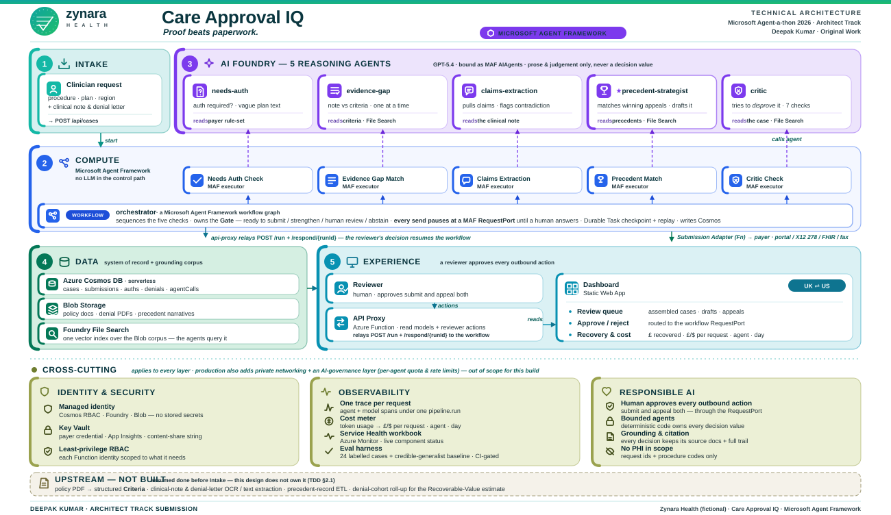

# Zynara Health · Care Approval IQ — Technical Design Document

> *Proof beats paperwork.*
> **Version 4** · Microsoft Agent-a-thon 2026 · Architect Track Submission · Healthcare Prior Authorisation · Deepak Kumar · Original Work

*(Companion documents: `ARCHITECTURE.md` — design of record; `DECISIONS.md` — delta log;
`MAF-MIGRATION.md` — the orchestration rebuild; `../progress/STATUS.md` — build state.
`Care-Approval-IQ-Architecture_Design-V4.svg` is the authoritative diagram.)*

**What changed in V4:** the orchestration layer is a **Microsoft Agent Framework
Workflow** (was Azure Durable Functions), there are **five** reasoning agents (a
`claims-extraction` agent was added for the contradiction check), the Gate route
`AutoSubmit` is renamed **`ReadyToSubmit`**, and §3.1 / §7.3 now carry the
**measured** credible-generalist comparison. The hybrid principle is unchanged.

---

## 1. Problem Statement

A clinician wants to treat a patient — an MRI, a specialist referral, a course of
physiotherapy, surgery. Before it can go ahead, the patient's insurer must
**authorise it in advance** ("prior authorisation" / "pre-authorisation"). Today
that process is manual, slow, and error-prone.

- **What this costs:** US hospitals spend **$687B/yr on administration** vs
  **$346B on direct patient care**; prior authorisation is named the single
  largest automatable cost centre in health-system admin. Patients wait weeks;
  some get worse or die waiting.
- **What's missing:** nobody is reading the clinical chart against the specific
  payer's specific criteria *before* submission, nobody is checking whether the
  fact pattern historically wins on appeal, and nobody is watching an approved
  authorisation for expiry before the procedure is scheduled.
- **The appeals gap (the number the design is built around):** only **11.5%** of
  denied requests are appealed, yet **80.7%** of appeals **win** (95% for
  skilled-nursing). **62% of physicians don't appeal because they believe
  they'll lose** — a belief provably wrong from the payer's own recorded
  outcomes.
- **The ask (per the course brief):** design a production-ready multi-agent
  workflow — ≥2 specialised agents with distinct responsibilities, the tools and
  data each uses, and why multi-agent beats a single generalist — that moves a
  real business process from prototype to production.

## 2. Mission & Scope

**Request inputs:** procedure/service requested · patient coverage reference ·
free-text clinical note · payer + plan · (post-decision) the denial letter.

**Mission:**
- Assemble a gap-checked prior-authorisation submission
- Recommend and draft the appeal when the fact pattern historically wins
- Watch approved authorisations for expiry and payer policies for drift

**In scope for this design:**
- End-to-end pipeline: request → needs-auth → evidence gap → claims extraction /
  contradiction → precedent match → **critic** → deterministic Gate → human review
  (a MAF `RequestPort`) → submit → (on denial) appeal draft → review
- Human-in-the-loop approval for **every** outbound action (submit and appeal)
- **Payer-agnostic** rules-as-data, with a visible **UK ⇄ US region switch** that
  swaps the criteria set, terminology and appeal-escalation path
- Grounding: every recommendation cites the policy clause and the precedent
  case ids that drove it
- The **Estimated Recoverable Value** — the appeals-gap statistic turned into the payer's
  own number (`not-appealed × comparable-win-rate × mean-claim-value`), shown with
  its inputs and a confidence level on its own dashboard tab

**Explicitly out of scope (see §8):**
- Real payer EHR/FHIR integration (synthetic + public-policy-excerpt data for the
  demo; CMS-0057-F mandates the real APIs on a 2027 timeline)
- Real PHI — request ids and procedure codes only; no patient-identifying data in
  telemetry or logs
- Automated submission without human sign-off — deliberately never built
- Clinical decision-making — the system is decision *support*, never medical or
  coverage advice; a person decides

### 2.1 Upstream assumptions — the workflow starts *after* document extraction

The pipeline assumes these are done by processes **outside this design**. They
are stated here and shown on the architecture diagram as the dashed
"UPSTREAM — NOT BUILT" band under the layers.

| Assumption | What we assume is already done | Owner | Status |
|---|---|---|---|
| **Payer criteria are structured data** | Each policy PDF has already been turned into the versioned `Criteria` list (`Criterion(Id, Text, Mandatory)`) in Cosmos. There is **no policy-PDF → criteria ingestion agent** — `PolicyDiff` only *diffs* successive structured versions. | Payer-config / clinical-ops curation (human-approved) | not built; production needs an ingestion tool |
| **The clinical note is text** | `Request.ClinicalNote` arrives as plain text. Any OCR / PDF / EHR-document parsing has happened upstream. | Intake / document service | not built; `string` in the demo |
| **The denial letter is text** | Same — the letter body is plain text; the denial-letter scan then reads it deterministically for reason codes. | Intake / document service | not built; `string` in the demo |
| **Precedent metadata is structured** | Past cases already have `Precedent` records (codes, clauses, outcome, fact-pattern narrative) in Cosmos + the narratives in Blob/File Search. | Case-history ETL | not built; seeded in `DemoWorld` |
| **Denial-history cohorts are pre-aggregated** | `DenialCohort` counts (denied / appealed / won / not-appealed / mean claim value) are rolled up from the case record; the Estimated Recoverable Value consumes them, it does not compute them from raw claims. | Reporting roll-up | not built; seeded in `DemoWorld` |

What the pipeline **does** own: reading that already-extracted text against the
already-structured criteria (`evidence-gap`), reconciling the claims in the note
(`claims-extraction`), matching precedents (`PrecedentMatch` + `precedent-strategist`),
and grounding the agents in the policy/precedent corpus via **Foundry File Search**.

## 3. Solution Overview

Care Approval IQ is a multi-agent system on:
- **Microsoft Foundry Agent Service** — five persistent reasoning agents
- orchestrated by a **Microsoft Agent Framework Workflow** — a typed graph of
  executors on a **Durable Task** backend, hosted in `Zynara.WorkflowHost`
- over **Azure Cosmos DB** (serverless) for operational state, with the
  unstructured corpus (policy documents, denial letters, precedent narratives)
  in **Azure Blob Storage** indexed by **Foundry File Search**
- fronted by a **Static Web App** dashboard

*(Every technology choice below — the MAF workflow, the executors, the removed
queue, Cosmos over SQL, the split doc store — is recorded with its rationale and
its rejected alternative in §12 · Technology Decisions. The rebuild from Durable
Functions to MAF is `MAF-MIGRATION.md` + `DECISIONS.md` D32–D38.)*

It replaces manual pre-auth assembly and the "don't bother appealing" reflex with
a small team of reasoning agents that build **and challenge** a case, deterministic
code that decides, and a human reviewer who authorises.

- **Five reasoning agents that collaborate, not a pipeline of prompts.**
  `needs-auth` reads ambiguous plan language · `evidence-gap` maps the clinical
  note to the written criteria · `claims-extraction` pulls the discrete
  assertions from the note so a deterministic check can spot a self-contradiction
  · `precedent-strategist` reasons over recorded precedent outcomes and drafts the
  appeal · **`critic`** then tries to *disprove* the assembled recommendation
  (unsupported claims, non-comparable precedents, over-strong conclusions, hidden
  contradictions, whether the system should abstain). Agents reason and challenge
  one another; the deterministic Gate decides; the human authorises.
- **Two deterministic monitors** — `ExpiryMath` (date arithmetic) and `PolicyDiff`
  (text diff) run continuously and raise advisory Early Warnings. They are
  deterministic services with a thin optional narrator, **not** reasoning agents
  (D6).
- **One mandatory outbound path** (the Submission Adapter) — no agent submits to
  a payer or files an appeal directly.
- **A deterministic Gate that weighs a structured model, not one averaged
  number** (D4). Mandatory criteria are a hard gate — never averaged away; a
  contradiction is never silently resolved; and the system can explicitly
  **abstain** when the evidence is too thin. The four routes:
  `ReadyToSubmit / Strengthen / HumanReview / Abstain`, each shown with its working.
- **Hybrid principle (carried from the prior project's D12):** deterministic code
  owns every value that drives a decision or an action; agents produce the prose
  and the judgement over unstructured text.

### 3.1 Why multi-agent beats one generalist

One prompt asked to "read the plan, map the note to the criteria, weigh the
precedents, draft the appeal, and check your own work" is worse at every part and
impossible to trust. This design is multi-agent because the agents do genuinely
different kinds of reasoning **and hold each other to account**:

1. **Different reasoning modes.** Ambiguous-contract reading, free-text
   comprehension against a rubric, claim extraction, corpus-level fact-pattern
   matching, and adversarial self-review are five different skills. Each agent has
   one job, one prompt, and one evaluation target.
2. **A dedicated challenger.** The `critic-agent` never builds — it only tries to
   disprove. It catches unsupported claims, non-comparable precedents,
   over-strong conclusions and hidden contradictions that a single generalist
   producing its own answer will not flag on itself. Its verdict can force a
   human or an abstention.
3. **Independent evaluation.** `evidence-gap` is scored in isolation against a
   labelled dataset (§7.3 / Challenge 3) — precision, recall, mandatory
   false-negative rate. That is only possible because its job is not entangled
   with four others.
4. **A seam for the human, and for the deterministic Gate.** The Gate sits
   *between* the agents' reasoning and any action. A monolithic agent that both
   decides and acts leaves nowhere for the Gate — or the reviewer — to live.
5. **Auditability.** Each agent's output is a separate cited record: which
   criterion, which precedent, which clause, what the Critic challenged. A
   regulator or the Financial Ombudsman Service can follow the whole trail.

**Measured, not asserted.** `Zynara.Eval` runs the same 24 labelled cases through
the five-agent pipeline and through **one credible GPT-5.4 generalist** — same
inputs, and a prompt that explicitly tells it to never auto-submit, never call an
unmet mandatory criterion "met", and abstain on thin evidence (the full prompt is
`eval/Zynara.Eval/BASELINE.md`):

| | Five-agent pipeline | Credible one-pass generalist |
|---|---|---|
| Route agreement with the expert labels | **100%** | 62.5% |
| **Unsafe automations** (marked ready when an expert would not) | **0** | **4** |
| Safe abstention (declined when the evidence was too thin) | **4 / 4** | **1 / 4** |
| Mandatory-criterion false negatives | **0** | 1 |
| Hallucinated references | 0 | 0 |

The generalist — a current model, carefully prompted — still wanted to submit
four cases an expert would route to a human, one of them with a note that
contradicts itself, and abstained on only one of the four cases that call for it.
That gap is what the architecture buys. The CI gate
(`EvalGateTests.Agents_beat_the_generalist_baseline_on_unsafe_automation`)
enforces `pipeline.unsafe ≤ baseline.unsafe` and `pipeline.routeAgreement ≥
baseline`; the generalist's verbatim responses are committed as replay fixtures so
CI stays offline (D38).

## 4. Technical Architecture



*(`Care-Approval-IQ-Architecture_Design-V4.svg` is the authoritative source.)*

The orchestration layer is a **Microsoft Agent Framework Workflow** — a typed
graph of executors on a Durable Task backend, hosted in `Zynara.WorkflowHost`
(`Microsoft.Agents.AI.Workflows` + `Microsoft.Agents.AI.Hosting.AzureFunctions`).
It replaced an Azure Durable Functions orchestrator; the rebuild and its findings
are `MAF-MIGRATION.md`, the decisions are `DECISIONS.md` D32–D38, and the "why"
is §12 · TD-1 / TD-2. The hybrid principle is untouched: the Gate is a plain
deterministic executor + a `switch`, never an agent, and agents still only
produce prose.

Five layers along the request path — Intake is the request contract plus the
workflow's auto-generated HTTP starter (no separate Function App, no queue) —
plus three cross-cutting concerns.

| # | Layer | Components |
|---|-------|-----------|
| 1 | **Intake** | The request contract (procedure · plan · region · clinical note · prior denial letter — the note and letter as attached text) → the workflow's generated `POST /api/workflows/CareApprovalPipeline/run?runId={requestId}` starter, fronted by the **API Proxy** so the dashboard keeps one origin. Validates the DTO, dispatches the Durable orchestration keyed on the request id, returns immediately. Not a separate Function App and not a queue (§12 · TD-3). *Open: portal form vs. API client vs. FHIR bundle for v1 — see §8.* |
| 2 | **Compute · Orchestration** (Microsoft Agent Framework) | `Zynara.WorkflowHost` — a MAF Workflow graph. Executors (`Needs Auth · Evidence Gap · Claims Extraction · Precedent Match · Critic · Gate · Persist · Review-card · Apply-decision · Submit`) are ~3-line adapters over the unchanged `Zynara.Core.Pipeline.*` classes; each runs as a **Durable Task activity** — per-step retry, checkpoint, replay-safe resume — for the reasons in §12 · TD-2. The Gate is a deterministic executor feeding an `AddSwitch`; every case that needs a submission pauses at a `RequestPort` for a human. `ExpiryMath` / `PolicyDiff` run as advisory monitors outside the graph. |
| 3 | **AI Foundry · Agent Service** | five reasoning agents — `needs-auth-agent` · `evidence-gap-agent` · **`claims-extraction-agent`** · `precedent-strategist-agent` · **`critic-agent`** — bound as **MAF `AIAgents`** (`AIProjectClient.AsAIAgent`) to the existing server-side versions, each behind a `Zynara.Core` interface with a deterministic stub twin. `ExpiryMath` / `PolicyDiff` narrator calls are optional and thin (D6). |
| 4 | **Data** | Submission Adapter (Azure Function · the only path to payer portal / X12 / FHIR / fax) → **Azure Cosmos DB** serverless (operational state): `requests · submissions · outcomes · auths · earlyWarnings · agentCalls`, plus `precedents` / `policies` **metadata** → **Azure Blob Storage** (the unstructured corpus: policy docs, denial PDFs, precedent narratives) → **Foundry File Search** (vector index the agents query). Split rationale: §12 · TD-4, TD-5. |
| 5 | **Experience** | Reviewer (human) → Dashboard (`Zynara.Dashboard`, Static Web App Standard + linked backend; tabs = **Review Queue** (drafts · appeals · HITL · Estimated Recoverable Value) · **Early Warnings** (expiry-watch · policy-drift) · **Cost** (£/$ per request · agent · day), with a **UK ⇄ US** header control) → **API Proxy** (Azure Function; read models + reviewer approve/reject actions) |

**Cross-cutting (applies to every layer):**
- **Security & Identity** — managed identity first: Cosmos DB (data-plane RBAC —
  `Cosmos DB Built-in Data Contributor`), Foundry (Cognitive Services User),
  Blob (`Storage Blob Data Contributor`). The two unavoidable strings (App
  Insights connection, content-share key) live in Key Vault as
  `@Microsoft.KeyVault` references. No PHI anywhere in scope.
- **Observability** — App Insights via the Azure Monitor OpenTelemetry exporter.
  `ZynaraTelemetry` (a single `ActivitySource`, `Zynara.Core.Diagnostics`) emits
  one `pipeline.run` span per request, a `spoke.<name>` child per deterministic
  spoke, an `invoke_agent <name>` child whenever a spoke calls its agent, and a
  `chat <model>` grandchild per hosted-model round-trip — so the trace shows
  exactly where reasoning happened (the stub path has the same tree minus the
  `chat` spans). Per-agent **cost meter** (£/$ per request · agent · day) off
  `agentCalls`, each row carrying the trace id. An Azure Monitor **Service Health
  workbook** for live component status (named, not built). The `Zynara.Eval` CI
  gate (§12).
- **Responsible AI** — the Gate routes every gap or low-confidence case to a
  human; the Submission Adapter is the sole actor that touches a payer;
  deterministic code owns every decision value; every recommendation retains its
  grounding (clause + precedent ids); an in-product disclaimer states *decision
  support, not coverage or medical advice*. Production hardening — private
  networking, an AI-governance layer (quota / rate limits / spend caps), a CI/CD
  deploy pipeline, HA/DR, secret rotation, PHI handling — is enumerated in §7.1,
  named but not built for the demo.

## 5. End-to-End Flow

`Run → NeedsAuth → Gap → Claims/Contradiction → PrecedentMatch → Critic → Gate → Persist → Review PORT → Send → Decision → Appeal → Review → Track`

1. **Run** — `POST /api/workflows/CareApprovalPipeline/run?runId={requestId}`
   (the MAF workflow's generated starter, fronted by the API Proxy) receives a
   request (procedure, coverage ref, clinical note, payer+plan, region), validates
   it, dispatches the Durable orchestration keyed on the request id (idempotent),
   and returns immediately. There is no separate intake function and no Storage
   Queue (§12 · TD-3).
2. **NeedsAuth** — `NeedsAuthCheck` (deterministic executor) resolves the
   payer+plan rule set for this procedure and region; `needs-auth-agent` narrates
   any ambiguous plan language and returns `{authRequired, code, policyRef}`. If
   not required → `Persist`, end, nothing submitted.
3. **Gap** — `EvidenceGapMatch` (deterministic executor) pulls the payer's
   written criteria (Foundry File Search over
   `policies/<region>/<payer>/<procedure>` in Blob); `evidence-gap-agent` reads
   the clinical note against them and returns per-criterion
   `{status, evidence-quote}` + an evidence-quality grade.
4. **Claims / Contradiction** — `claims-extraction-agent` lists the discrete
   assertions in the note (each with its subject and whether it is negated); the
   deterministic `ContradictionCheck` pairs an affirmed and a negated claim about
   the same subject. Any conflict is surfaced and hard-routes the Gate to a human
   — the system never silently picks a side (D17).
5. **Precedent Match** — `PrecedentMatch` (deterministic executor) filters the
   `precedents` metadata in Cosmos (payer, procedure, outcome, appeal result) and
   ranks the shortlist by fact-pattern similarity; `precedent-strategist-agent`
   reasons over the File-Search-retrieved precedent narratives, reports the
   recorded outcomes and recommends **submit / strengthen / appeal**.
6. **Critic** — `critic-agent` reviews the assembled case and runs its seven
   checks; its verdict (`Clear / Concerns / Block / Abstain`) and any flags are
   attached to the case.
7. **Gate** — a deterministic executor. Weighs the structured decision model
   (D4): any unmet **mandatory** criterion or a contradiction → `HumanReview`; a
   Critic `Block` → `HumanReview` regardless of the numbers; a Critic `Abstain` or
   Low-quality evidence with Weak/None precedent support → `Abstain`; value over
   the auto-limit → `HumanReview`; an undocumented supporting criterion, Medium
   evidence, or Critic `Concerns` → `Strengthen`; otherwise → `ReadyToSubmit`.
   Every route carries its working.
8. **Persist + Review PORT** — `Persist` writes the `CaseRecord` (the dashboard's
   read model + the audit trail). **Every case that needs a submission then pauses
   at a MAF `RequestPort`** — the workflow suspends until a reviewer answers via
   `POST /respond/{runId}`. `ReadyToSubmit` only sets the reviewer's headline
   ("ready — one click to send"); it is still a human `/respond` that sends (D35).
   `ApprovalAuthority` runs in the executor that consumes the response and can
   refuse-and-audit an under-authorised approval.
9. **Send** — on an authorised `approve-send`, the `Submit` executor calls the
   Submission Adapter, which submits to the payer in their format (portal / X12
   278 / FHIR / fax) — the only outbound path.
10. **Decision** — approved → step 13; denied → step 11. The denial letter text
    is scanned deterministically for the reason code and the clause cited.
11. **Appeal** — `precedent-strategist-agent` drafts the appeal citing the specific
    policy clause misapplied and the precedent case ids; `critic-agent` reviews
    the draft; deterministic code fills the dates and the escalation route
    (region-specific: state/external review vs. Financial Ombudsman Service).
12. **Review** — the reviewer approves the appeal at the port; the Adapter files it.
13. **Track** — `ExpiryMath` watches the approved auth's validity window against
    the scheduling feed and raises an `EarlyWarning` if it will expire before the
    procedure date; `PolicyDiff` watches payer policy versions and raises a
    `DriftAlert` naming the affected templates. Both are deterministic and
    advisory — no Gate, no outbound action, no agent (D6).

Throughout: one trace per request (`pipeline.run → spoke.* → invoke_agent * →
chat *`) across every hop; every agent call written to `agentCalls` with the
trace id (the §7.1 cost meter reads it); no agent performs an outbound action.

## 6. Components, Service by Service

**Intake** — the request contract: `{ procedure, plan, region, clinicalNote,
priorDenialLetter? }`, where `clinicalNote` and `priorDenialLetter` are text, the
rest structured fields. Delivered to the MAF workflow's generated starter
`POST /api/workflows/CareApprovalPipeline/run?runId={requestId}`, fronted by the
API Proxy so the dashboard keeps one origin: validates the DTO, dispatches the
Durable orchestration keyed on the request id, returns immediately. There is no
separate Function App for intake and no queue (§12 · TD-3). **Open (§8):** whether
the caller is a portal SPA form, a REST client, or a FHIR R4 bundle for v1.

**Compute · Orchestration (Microsoft Agent Framework)** — `Zynara.WorkflowHost`,
a `FunctionsApplication` + `ConfigureDurableWorkflows`:
- **The workflow graph** — a typed `WorkflowBuilder` graph. A coarse `assemble`
  executor runs the whole reasoning pipeline in-process and persists the
  `PipelineResult` to Cosmos (keeping the Durable `CustomStatus` snapshot under
  its 16 KB cap); from there the message is a slim `Flow` record. The Gate route
  drives an `AddSwitch`, and every case that needs a submission suspends at a
  `RequestPort` until a reviewer `/respond`s. A fine-grained per-executor graph
  (`Needs Auth · Evidence Gap · Claims Extraction · Precedent Match · Critic ·
  Gate`) is kept for `InProcessExecution` tests and the eval harness.
- **Executors** — ~3-line `BindAsExecutor` lambdas over the unchanged
  `Zynara.Core.Pipeline.*` classes. On the durable host each becomes a Durable
  Task **activity**: per-step retry, checkpoint, replay-safe resume (§12 · TD-2).
- **`ExpiryMath` / `PolicyDiff`** run as advisory monitors outside the graph.

**AI Foundry · Agent Service** — **five reasoning agents** provisioned via
`Azure.AI.Projects` and invoked as **MAF `AIAgents`**
(`AIProjectClient.AsAIAgent(new AgentReference(name))` binds to the existing
server-side version), each wired behind a `Zynara.Core` interface with a
deterministic stub twin:
| Agent | Reasoning job | Tools / grounding |
|---|---|---|
| `needs-auth-agent` | Plain-language reading of ambiguous plan text | payer rule-set KB, procedure-code lookup |
| `evidence-gap-agent` | Free-text clinical note vs. the numbered criteria — per-criterion status + the supporting quote + an evidence-quality grade | Foundry File Search over `policies/` (Blob), the clinical note |
| **`claims-extraction-agent`** | Lists the discrete assertions in the note — each with its subject and whether it is negated — so `ContradictionCheck` can pair an affirmed and a negated claim about the same subject | the clinical note only |
| `precedent-strategist-agent` | Corpus-level fact-pattern match over recorded outcomes; drafts the appeal argument | `precedents` metadata (Cosmos) + precedent narratives (File Search), policy clause text |
| **`critic-agent`** | Tries to disprove the assembled recommendation — the seven checks (§3) — and can force a human or an abstention | the whole assembled case + File Search to verify citations |

The two continuous monitors, `ExpiryMath` (date arithmetic) and `PolicyDiff`
(text diff), are **deterministic services**, not agents (D6). Each may call a
thin narrator agent purely for alert wording; the detection and the numbers stay
in code.

**Data** —
- **Submission Adapter** (Function · Data Source Adapter; the only path to payer
  portal / X12 / FHIR / fax).
- **Azure Cosmos DB** serverless (Core/NoSQL) — operational state, one container
  per aggregate: `requests`, `submissions`, `outcomes`, `auths`,
  `earlyWarnings`, `agentCalls`, plus `precedents` and `policies` **metadata**
  (`{caseId|policyRef, payerPlan, procedure, outcome, wonOnAppeal, blobRef, …}`).
  Partition key `/requestId` (case containers) or `/payerPlan` (precedent
  metadata); session consistency — one orchestration owns a request id, so no
  multi-writer race. Tests use the Cosmos DB Emulator behind an `IZynaraStore`
  seam with an in-memory implementation for unit tests (pattern carried from the
  prior project's data-double). Rationale for Cosmos over SQL: §12 · TD-4.
- **Azure Blob Storage** — the unstructured corpus:
  `policies/<region>/<payer>/<procedure>.md` (+ versioned copies),
  `denials/<requestId>.pdf`, `precedents/<caseId>.md`.
- **Foundry File Search** — the vector index over the Blob corpus that the
  agents query. Split rationale: §12 · TD-5.

**Experience** — Reviewer (human); Dashboard (`Zynara.Dashboard`, Static Web App
Standard + `linkedBackends` → apiproxy, same-origin `/api`): four tabs —
**Review queue** (the HITL list: assembled cases and appeals to approve or edit,
with the Estimated Recoverable Value as a headline number), **Early warnings**
(`expiry-watch` + `policy-drift` output), **Impact** (Estimated Recoverable Value
+ a before/after benchmark), and a **Pipeline simulator** (an illustrative
stage-by-stage walk); the **UK ⇄ US** region switch is a header control, not a
tab. Approve / reject on a case posts to the workflow's `/respond/{runId}` port.
**API Proxy** (Function; read models + a thin `respond` relay).

**Cross-cutting** — managed identity (Cosmos data-plane RBAC / Foundry / Blob);
Key Vault (App Insights + content-share strings + the one payer credential, as
`@Microsoft.KeyVault` refs); App Insights (one trace per request); `Zynara.Eval`
(24 labelled clinical cases + the credible-generalist baseline, CI-gated on the
§7.3 safety metrics); `Zynara.DbDeploy` (azd post-provision: create Cosmos
containers, seed the reference data; the Blob corpus + File Search index are
loaded manually for the demo).

## 7. Responsible AI

In scope — built and demonstrated:

- **Every outbound action is human-approved.** Submit and appeal both. The
  Submission Adapter is the sole actor with payer reach; nothing else in the
  system performs an outbound action. Mirrors the prior project's
  Gate/sole-writer pattern (D14).
- **Bounded agents.** Deterministic code owns every value that drives a decision
  or an action; agents produce prose and judgement over unstructured text only
  (§9 — the hybrid principle).
- **Grounding & citation, retained.** Every recommendation records the exact
  inputs it used — the policy clause ids, the criteria version, the precedent
  case ids — persisted on the `submissions` / `outcomes` document alongside the
  Gate's working. Any decision can be replayed: which criterion → which
  precedent → which clause. This is a field on the document, not new
  infrastructure.
- **Structured routing, not a black-box number** (D4). The Gate's route is
  deterministic and shown with its working — e.g. *"HumanReview — mandatory
  criterion unmet (conservative-treatment); supporting 2 documented / 0 partial /
  1 missing; evidence High; contradiction none; precedent support Strong."* A
  missing mandatory criterion is never averaged away by supporting ones.
- **Per-agent cost metering.** Every agent response carries `Usage`
  (`promptTokens`, `completionTokens`, `model`); `{usage, model, traceId,
  requestId, agent}` is persisted per call to `agentCalls`, aggregated to £/$
  **per request · per agent · per day** on the dashboard's Cost tab. (Token
  usage → price table → sum; a few lines, carried from the prior project.)
- **No PHI in scope.** Request ids and procedure codes only in telemetry, logs,
  and the trace tree; clinical notes are synthetic for the demo.
- **Reviewer roles + approval authority** (`ApprovalAuthority`, built). Four roles
  (Coordinator → Reviewer → Senior Reviewer → Medical Director). The authority
  needed to **approve &amp; send** is the higher of the route tier
  (ReadyToSubmit/Strengthen → Coordinator, HumanReview → Reviewer, Abstain → Senior)
  and the **financial-risk tier** (≤ £500 → Coordinator, ≤ £5k → Reviewer,
  ≤ £25k → Senior, above → Medical Director); an appeal is always at least a
  Senior sign-off. The `ReadyToSubmitLimit` is just the bottom tier — above it a
  case escalates to a more senior human, not to a bigger number. A refused
  decision is itself written to the audit trail. *(Demo: the role is a header /
  a picker; production maps to Entra ID app roles.)*
- **Append-only case audit trail** (`CaseRecord.Audit`, built). Every pipeline
  run records the agent implementation **and version** behind each reasoning step
  (`evidence-gap · foundry hosted/gpt-5.4`); every reviewer action records the
  identity, role, timestamp and note; every refusal records the reason. Shown to
  the reviewer in the case drawer.
- **Disclaimer, shown in-product:** *Care Approval IQ is decision support, not
  coverage or medical advice. A person makes every decision.*

### 7.1 Production readiness — what this build deliberately leaves out

The demo is a solo, 18-day build (§8). The architecture is production-*shaped*
(managed identity from commit 1, deterministic Gate, sole outbound path, one
correlated trace, CI + tests, an eval gate) but a real deployment would add the
following. Each is named so a judge can see the gap is understood, not missed.

| Area | What production adds | Why it is out of scope here |
|---|---|---|
| **Network isolation** | Cosmos DB, Blob and Foundry on a VNet behind **private endpoints** + private DNS; the Function Apps VNet-integrated; NSGs so the **reasoning-plane subnet cannot reach the payer subnet** — a belt-and-braces network boundary on top of the identity split. | Adds nothing a judge sees in a 3-min demo, and the guardrail (review §18) is explicit about not adding Azure services for an enterprise look. The **identity boundary is built** (`infra/` — the reasoning identity has no payer secret, the submission identity has no model access); the *network* boundary is the production hardening on top. |
| **AI-governance layer** | Per-agent Foundry **quota and rate limits**, a **model allow-list**, per-tenant **spend caps** — enforced at the platform, not just metered on the dashboard. Prompt-shield / jailbreak filtering on agent inputs. | We meter cost (in scope); enforcing caps needs Foundry policy config + a budget-alert → disable loop that isn't demo-visible. |
| **CI/CD deployment pipeline** | GitHub Actions: build + test + eval-gate (already in CI) → **`azd deploy` to a staging slot** → smoke test → **manual approval** → production, with **infra drift detection** (`azd provision --preview` / `what-if`) and automatic rollback on health-probe failure. Environments per branch. | CI (build + test + eval) exists from commit 1; the deploy half needs a standing Azure subscription + slots + approvers we don't set up for a demo. |
| **Model / prompt versioning** | Every agent version + its system prompt pinned and recorded against the outcomes it produced, so any decision is reproducible; prompt changes go through the same PR + eval gate as code. | Foundry versions the agents; wiring the outcome↔version link and a prompt-change gate is a few days of plumbing. |
| **Continuous quality monitoring** | The `Zynara.Eval` harness (§12) runs against live **de-identified** traffic on a schedule, alerting on accuracy regression and drift; a human-review sampling queue feeds labelled data back. | Eval is CI-only here (gates the build). Live scoring needs a de-identification step + a labelling workflow. |
| **HA / DR** | Cosmos multi-region (or zone-redundant) writes; Blob GRS; Function App on a plan with zone redundancy; a documented **RTO/RPO** and a restore runbook tested quarterly. | Single-region serverless is right for a demo; multi-region is a cost + config decision for a real SLA. |
| **Scale & resilience** | Load test to the real request rate; Durable Functions auto-scales, but tune host concurrency, activity timeouts and retry policies to measured numbers; circuit-breaker on the Submission Adapter. | Demo volume is tens/day; the retry/timeout defaults are fine until there is real traffic to measure. |
| **Secrets & compliance** | Key Vault secret **rotation** (the two unavoidable strings), a data-residency guarantee per region, a retention + deletion policy for the corpus and the outcomes store, an access-review cadence, and a **PHI handling design** (the demo carries none — production would, and needs de-identification, field-level encryption, and audit). | The demo carries **no PHI** by design; the moment it does, this becomes the largest workstream. |
| **Security assurance** | Threat model, dependency + container scanning in CI (Dependabot + `dotnet list package --vulnerable`), a penetration test before go-live, and a WAF in front of the Static Web App + API Proxy. | Standard pre-prod gates; nothing to demonstrate in the submission. |
| **Real payer connectivity** | The Submission Adapter's portal-RPA / X12 278 clearinghouse / FHIR Prior-Authorization implementations, plus an eligibility / active-coverage check. See §9. | CMS-0057-F mandates the FHIR APIs on a 2027 timeline; synthetic data proves the pipeline today. |

The architecture SVG carries a one-line note to this effect under CROSS-CUTTING.

**What would *not* change at production scale:** the deterministic MAF workflow
owning the Gate (TD-1), the pipeline steps as discrete executors / Durable
activities (TD-2), the sole outbound path, the human `RequestPort` before every
send, the hybrid principle, and Cosmos + Blob + File Search as the store split
(TD-4, TD-5) — these are scale-independent choices.

### 7.2 Policy + Regulatory Profile (not a "region switch")

The "UK ⇄ US switch" is a **Policy + Regulatory Profile** (evaluator §9), built as
`RegulatoryProfile` in `Zynara.Core` and exposed at `GET /api/profiles`. A profile
carries, per region:

| Dimension | UK | US |
|---|---|---|
| Policy pack | per-payer plan rule-sets (Bupa / AXA / Vitality), versioned per procedure | payer medical policies + InterQual / MCG, versioned per procedure |
| Terminology | prior authorisation · clinician / consultant · insurer · CCSD code | prior authorization · provider · health plan · CPT / HCPCS code |
| Coding conventions | CCSD · ICD-10 | CPT / HCPCS · ICD-10-CM |
| Regulators | FCA · Financial Ombudsman Service · UK GDPR / DPA 2018 | CMS (CMS-0057-F) · ERISA · HIPAA · state DOIs |
| Appeal / escalation path | payer reconsideration → FOS → courts | payer appeal → external IRO → state DOI / ERISA |
| Integration profile | no mandated PA API — portals + PDF | X12 278 today; FHIR PAS (Da Vinci) mandated from Jan 2027 |
| Currency | GBP / £ | USD / $ |

Payer-specific knowledge stays **data, not code** — criteria and rules in Cosmos
keyed by region + payer + procedure, profiles in `config/profiles/*.json` — so a
compliance reviewer can see and version exactly what the system applied.
**Not a product centrepiece** (guardrail §18) — a small header panel, not a demo
beat.

### 7.3 Evaluation — beyond classification accuracy

A CI gate on classification accuracy is a start; a high-risk administrative
workflow needs safety-shaped metrics. `Zynara.Eval` replays a labelled
clinical-case set (ground truth per criterion + expected route + expected
citations) and measures:

| Metric | Why it matters |
|---|---|
| Evidence-extraction **precision / recall** | does the agent find what is there, without inventing what is not |
| **Mandatory-criterion false-negative rate** | the unsafe direction — calling a missing mandatory criterion "met" |
| Mandatory-criterion false-positive rate | the annoying direction — over-flagging |
| **Policy-citation accuracy** | the assembled draft names the governing policy ref (CI floor 95%) |
| **Precedent-citation accuracy** | the cited precedent ids match the labelled set (CI floor 80%) |
| **Hallucination rate** | criterion ids not in the set, precedent ids not on record, or a policy clause in the appeal draft that no shortlisted precedent cited — CI hard-gate: **must be 0** |
| **Appeal-recommendation agreement** vs. labels | the `precedent-strategist` verdict (Submit / Strengthen / Appeal) matches the expert label (CI floor 80%) |
| **Safe-abstention rate** | of the cases an expert marks "not enough to advise", how many did the system route to `Abstain` (CI floor 80%) |
| **Unsafe-automation rate** | cases the system marked ready to submit that an expert would not have — CI hard-gate: **must be 0** |

CI hard-gates the safety metrics (unsafe automation = 0, mandatory false-negative
= 0, hallucinated references = 0) and holds a floor on route agreement,
safe-abstention, strategy-verdict agreement and policy/precedent citation.

**The credible-generalist comparison** (§3.1) runs the same 24 cases through one
GPT-5.4 generalist given identical inputs and a safety-focused prompt, scored on
the same metrics. The pipeline agrees with the expert labels **100% vs 62.5%**,
records **0 unsafe automations vs 4**, and abstains **4/4 vs 1/4** where an expert
would. CI enforces `pipeline ≥ generalist` on both unsafe automation and route
agreement. The generalist's verbatim responses are committed as replay fixtures
(`eval/Zynara.Eval/baseline-fixtures/`, each with a prompt hash) so CI stays
offline; the full prompt and method are `eval/Zynara.Eval/BASELINE.md` (D38).

## 8. Deployment & Scope Decisions

Deliberate trade-offs for a solo, part-time build in an 18-day window
(2026-09-05 → demo-ready 2026-09-20 → submit 2026-09-22, deadline 2026-09-23
midnight US).

- **Synthetic + public-excerpt data over real payer integration** — CMS-0057-F
  forces the real FHIR APIs into existence on a 2027 timeline; for the demo,
  ~30 LLM-generated clinical cases (with a hidden ground-truth of which criteria
  each meets), ~10 procedures × 2 regions of transcribed public criteria (Bupa
  CCSD, a small set of US Medicare LCDs), ~150 internally-consistent synthetic
  past outcomes, and 3 policy-version pairs for the drift demo.
- **Pre-computed demo playback over live inference** — the scripted 3-minute
  demo browses already-processed results for instant, consistent playback; the
  live pipeline is shown separately on one fresh case. (Prior project's lesson:
  Usability — "performs well consistently" — punishes latency and inconsistency
  harder than a good idea rewards it.)
- **Cosmos DB serverless for operational state, Blob + File Search for the
  corpus** — see §12 · TD-4, TD-5. Tests use the Cosmos DB Emulator behind an
  `IZynaraStore` seam (in-memory for unit tests).
- **No Requests Queue** — the Durable HTTP starter is the async boundary; see
  §12 · TD-3.
- **New resource group, managed-identity-first from commit 1** — not retrofitted.
- **Payer-agnostic, lead with UK (Bupa/AXA)** — EMEA-region judging; CMS-0057-F
  stays as the "why now" data point, not the framing.
- **Build priority if time runs short (agreed order):**
  1. workflow starter → graph → NeedsAuth + Gap + PrecedentMatch → Gate →
     Submission Adapter → Cosmos/Blob (the core mission), with `needs-auth` +
     `evidence-gap` + `precedent-strategist` agents
  2. Dashboard Review Queue + Reviewer loop + the Estimated Recoverable Value, on real
     (synthetic) data
  3. Region switch (UK ⇄ US)
  4. `expiry-watch` + `policy-drift` agents and the Early Warnings tab
  5. `Zynara.Eval` CI gate + portal evaluation (Challenge 3)

- **Open — request intake format for v1.** Portal SPA form, plain REST client, or
  a FHIR R4 bundle. Default assumption: a simple JSON DTO + file uploads
  (clinical note, denial letter) posted by a thin portal form; a FHIR bundle
  adapter is the first production integration (§9).

## 9. Out of Scope · Future Roadmap

- **Real payer connectivity** — FHIR Prior Authorization / Provider Access APIs,
  X12 278 clearinghouse, portal RPA. CMS-0057-F mandates these by Jan 2027.
- **FHIR bundle intake** — v1 takes a simplified request DTO; a FHIR R4 bundle
  adapter is the first production integration.
- **Eligibility / active-coverage check** — a separate payer system call; assumed
  valid for the demo.
- **Peer-to-peer prep** — assembling the clinician's talking points for the
  10-minute call with the insurer's medical director, from all of the above.
- **Learning from reviewer edits** — closing the loop so the Gate threshold and
  the draft templates improve from what reviewers actually change.

## 10. Mapping to the Agent-a-thon Challenges

| Challenge | Deliverable here |
|---|---|
| **0 — Foundry setup** | `azd provision` — account, project, model, App Insights, **new resource group** |
| **1 — build agents via SDK** | 5 persistent reasoning agents (incl. the Critic) via `Azure.AI.Projects`, invoked as **MAF `AIAgents`**, wired behind `Zynara.Core` interfaces with stub twins; agents reason and challenge one another (§3.1) |
| **2 — agent-keyed traces** | **built** — `Zynara.Core.Diagnostics.ZynaraTelemetry` `ActivitySource` emits `pipeline.run` → `spoke.<name>` → `invoke_agent <name>` → `chat <model>` (the last only on the hosted path); tags carry request id, route, per-`chat` token counts. The workflow host registers the source with the Azure Monitor OpenTelemetry exporter when `APPLICATIONINSIGHTS_CONNECTION_STRING` is set; `IAgentCallRecorder` writes the trace id onto each `agentCalls` cost row. `TelemetryTests` asserts the span tree; verified live from `zynara-workflowhost`. |
| **3 — evaluate an agent** | Two halves. **Quality** — the Foundry *portal* evaluation of `evidence-gap-agent`: Coherence / Fluency over `eval/portal/eval_portal.jsonl` (15 turns), runbook `docs/runbooks/challenge-3-portal-evaluation.md`. **Correctness** — `Zynara.Eval` CI gate on the safety-shaped metric suite (§7.3) over **24 labelled cases**, plus the credible-generalist comparison (pipeline 100% vs 62.5% route agreement, 0 vs 4 unsafe automations). |
| **4 — persistent assets + portal workflow** | agents visible as assets; a 2–3 node portal workflow (`care-approval-reasoning`); the conditional Gate / review-port / appeal branching lives in the **MAF Workflow graph** (`Zynara.WorkflowHost`), where it is deterministic and testable |
| **AI governance** | cost metering is built (dashboard Cost tab); the enforcement layer — quota / rate limits / spend caps / model allow-list — plus versioning and live drift monitoring are enumerated in §7.1 as production hardening, not built for the demo |

## 11. How the Design Targets the Three Judging Criteria

| Criterion | The move |
|---|---|
| **Innovation** | Precedent-driven appeal recommendation grounded in **recorded outcomes** — nobody productises the "80% of appeals win, 11.5% are filed" gap. The region switch proves generality *live*, not as a claim. |
| **Usability** | Pre-computed demo playback (zero inference lag), one intuitive queue→review→send flow, the region switch, an accessibility pass, and a recorded 3-minute video as the fallback if a live demo breaks. |
| **Impact** | **Estimated Recoverable Value** (`RecoveryEstimator`, built) computes, from the payer's own denial history, `not-appealed × comparable-win-rate × mean-claim-value` per payer/procedure scope and as a portfolio total — Impact as a number **with every input on the surface** and a confidence level set by the sample size. Shown on its own dashboard tab. |

### 11.1 The four questions the review says we must answer to win

| Question | Where it is answered |
|---|---|
| **1. Do the agents make better decisions *together* than one generalist?** | §3.1 + §7.3 — the **measured** comparison against a credible one-pass GPT-5.4 generalist on the same 24 cases: **100% vs 62.5%** route agreement, **0 vs 4** unsafe automations, **4/4 vs 1/4** safe abstention. Not a straw man — the generalist is told to be safe and still is not. |
| **2. Does the system know when it is uncertain?** | The `Abstain` route (D4): Low-quality evidence + Weak/None precedent support, or a Critic `Abstain`, and the system declines to advise rather than guessing. Measured as the **safe-abstention rate** (§7.3) — a hard CI floor, and 4/4 on the labelled set. |
| **3. Why should a human trust the recommendation?** | Evidence-first review workspace: every criterion shows the clinical statement that satisfies it, the policy clause and version, the precedents considered with their similarity, the Critic's flags, and the Gate's working. Nothing is a black-box number. And **nothing is sent without an explicit human `/respond`** — even a `ReadyToSubmit` case pauses (D35). |
| **4. Is the business value measurable, not a marketing figure?** | **Estimated Recoverable Value** is built (`RecoveryEstimator` + `GET /api/recovery` + the Impact tab): the headline number, the four inputs, the arithmetic spelled out, and a confidence level — no invented improvement figure. A **before/after benchmark** (`BenchmarkService`, `GET /api/benchmark`) pairs each measured pipeline count with a labelled manual estimate — no improvement percentage claimed (D16). |

## 12. Technology Decisions

ADR-style. TD-1…TD-5 each record the decision, the reasoning, the cost accepted,
and the rejected alternative; TD-6 groups the platform defaults. `ARCHITECTURE.md`
§17 carries the one-line summary table. The architecture SVG (§4) is the
authoritative picture; this document must agree with it. The orchestration
decisions (TD-1, TD-2, TD-3) were re-taken when the layer moved from Azure
Durable Functions to the Microsoft Agent Framework — `MAF-MIGRATION.md`,
`DECISIONS.md` D32–D38.

### TD-1 · Orchestration is a deterministic Microsoft Agent Framework Workflow, not agent-to-agent chaining

**Decision.** A **MAF Workflow graph** — typed executors, typed edges, a Gate
`AddSwitch`, a human `RequestPort` — sequences the pipeline and owns every value
that drives a decision or an action. It runs on a **Durable Task** backend.

**Why.** The ready-to-submit-vs-review decision, the pipeline order, the Gate's
structured decision model and the audit trail must be deterministic and
repeatable — regulator- and Ombudsman-inspectable. A MAF Workflow is exactly
that: a deterministic typed graph, not "agents orchestrating agents" (TD-1a). It
also earns its place on its own merits — the Durable Task backend gives
checkpoint + replay for the slow, out-of-band payer round-trip (portal / fax can
take days), and a first-class `RequestPort` for the human pause that we would
otherwise hand-build. MAF is Microsoft's recommended pattern and the reference
architecture for the team's forthcoming agent projects (D32).

**Rejected.** (a) A single generalist agent orchestrating via connected agents —
non-deterministic call order, no seam for the human, no auditable Gate; the §3.1
measurement shows the safety cost. (b) Staying on the Durable Functions
orchestrator — it worked (tag `v1.0-durable`), but MAF folds the HTTP surface,
the human port and the checkpoint story into one framework-owned model, and is
the pattern the team is standardising on.

### TD-1a · A MAF Workflow is a deterministic graph — TD-1's "no agents orchestrating agents" still holds

The V1 rejection of *"a generalist agent orchestrating via connected agents"* was
about handing **control flow to an LLM**. A MAF Workflow does the opposite: the
graph, the edges, the Gate `switch` and the `RequestPort` are all deterministic
code. Agents are leaf executors that return prose; nothing about the sequence,
the routing or the human pause is model-decided. The hybrid principle is
unchanged — it is now enforced by the framework's type system rather than by our
own orchestrator discipline.

### TD-2 · The pipeline steps are MAF executors / Durable Task activities, not one method

**Decision.** `NeedsAuthCheck`, `EvidenceGapMatch`, `ClaimsExtraction`,
`PrecedentMatch`, `CriticCheck` and the `Gate` are each a MAF **executor**
(`BindAsExecutor` over the unchanged `Zynara.Core.Pipeline.*` class); on the
durable host each runs as its own **Durable Task activity**.

**Justification — four concrete properties, none of which one big method gives:**

1. **Per-step retry isolation.** An agent or File-Search call that 500s or times
   out is retried *at that step* with its own backoff. The other agent calls are
   neither re-run nor re-billed.
2. **The prose→value boundary is a named unit.** Each executor is where an
   agent's free-text reply becomes the typed record the Gate consumes. Keeping
   that parsing/scoring in its own unit stops it leaking into the routing logic.
3. **A stub twin per step, exercised in CI.** Each agent has a deterministic
   double (Challenge-1). The whole graph — ordering, Gate logic, the route switch
   — runs in CI via `InProcessExecution` with **zero live inference and no infra**:
   fast, free, repeatable. This is where the per-step route-agreement coverage and
   the §7.3 metrics live.
4. **Replay-safe resume.** Durable Task records each completed activity. A host
   restart or transient fault mid-pipeline resumes at the *next* step — a case is
   never double-submitted, and a paused review survives a redeploy.

**Cost accepted.** MAF serialises the whole workflow snapshot into the Durable
`CustomStatus`, hard-capped at 16 KB. The fine-grained accumulator overran it, so
the **durable** graph is coarse — one `assemble` executor runs the pipeline
in-process and the message downstream is a slim `Flow` record — while the
fine-grained per-executor graph is kept for `InProcessExecution` / the eval
harness. Two graphs, one set of `Zynara.Core.Pipeline` classes behind both.

### TD-3 · No explicit Requests Queue — the workflow's generated HTTP starter is the async boundary

**Decision.** `POST /api/workflows/CareApprovalPipeline/run?runId={requestId}` is
the MAF workflow's auto-generated HTTP starter: it validates the DTO, dispatches
the Durable orchestration keyed on the request id, and returns immediately. There
is no `Zynara.Intake` function and no Azure Storage Queue. The API Proxy fronts it
so the dashboard keeps one origin and sends the function key.

**Why.** This workload is request/response at low volume — tens/day for the demo,
low-hundreds/day realistically — with no burst to absorb. The only genuine
requirement is *don't hold the caller open for a multi-second-to-minute pipeline*.
The Durable Task backend already provides that: the starter returns immediately
and the orchestration runs on Durable's own control queues, which still give
at-least-once execution and back-pressure.

**Rejected.** A dedicated Storage Queue — an extra resource, an extra failure
mode, and an extra hop, justified by load that does not exist.

### TD-4 · Operational store is Azure Cosmos DB (serverless), not Azure SQL

**Decision.** Cosmos DB serverless (Core / NoSQL API) holds all operational
state — `requests`, `submissions`, `outcomes`, `auths`, `earlyWarnings`,
`agentCalls`, plus `precedents` and `policies` **metadata**.

**Why.**
- **Shape.** A request / submission / outcome is a nested aggregate — the
  clinical note, the gap-analysis result, the criteria list, the cited
  precedents — that maps to one JSON document, not to a normalised set of joined
  tables.
- **Access pattern.** Partition by `/requestId` (case containers) or
  `/payerPlan` (precedent metadata) makes "everything for this case" or "all
  precedents for this payer+procedure" a single-partition read.
- **Consistency.** Session consistency is sufficient — one orchestration owns a
  `requestId`, keyed and idempotent, so there is no multi-writer race on a case.
- **Cost & ops.** Serverless billing fits spiky, low demo volume; no schema
  migrations.
- **Team familiarity.** Prior project experience with Cosmos.

**Tests.** The in-memory relational double is replaced by an `IZynaraStore` seam
— in-memory implementation for unit tests, Cosmos DB Emulator for integration
tests.

**Rejected.** Azure SQL serverless — a relational schema, EF migrations, and
join modelling for data that is natively document-shaped; the prior project's
SQLite-at-runtime fragility is now moot since runtime is not SQL at all.

### TD-5 · Unstructured corpus is Blob Storage + Foundry File Search, separate from Cosmos

**Decision.** Policy documents, denial-letter PDFs, and precedent **narratives**
live in Azure Blob Storage; Foundry **File Search** owns the vector index the
agents query.

```
policies/<region>/<payer>/<procedure>.md      (+ versioned copies for the drift demo)
denials/<requestId>.pdf
precedents/<caseId>.md                          the fact-pattern narrative
```

Cosmos holds only the **structured metadata** about these artifacts —
`precedents = {caseId, payerPlan, procedure, outcome, wonOnAppeal, reasonCodes[],
blobRef, decidedOn}`, `policies = {policyRef, version, blobRef, effectiveFrom}`.

**Why the split.** Retrieval over the corpus is semantic — `evidence-gap` reads
a note against written criteria, `precedent-strategist` matches fact patterns — which
is a vector-search job, not a query job. Forcing it into Cosmos means building
and running our own chunk / embed / index pipeline; File Search does that for
the agents natively. `PrecedentMatch` (deterministic) filters the `precedents`
metadata in Cosmos first (payer, procedure, outcome), then the agent reasons
over the File-Search-retrieved narratives for the shortlist. `PolicyDiff` runs a
deterministic text diff over two Blob versions — no index needed.

**Rejected.** Cosmos-native vector search for the corpus — couples the corpus to
the operational DB and still needs a home-grown embedding pipeline. Azure AI
Search — more capable hybrid/semantic retrieval, but another service to
provision and secure for no demo-level gain.

### TD-6 · Platform choices

Grouped — each is the boring default for this shape of workload; the note is why
it beats the obvious alternative.

| Choice | Why | Rejected |
|---|---|---|
| **Foundry Agent Service** (persistent hosted agents), invoked as **MAF `AIAgents`** | Agents are versioned assets, portal-visible (Challenge 4), come with File Search + tool-calling + tracing wired. `AIProjectClient.AsAIAgent(new AgentReference(name))` binds to the existing server-side version — the workflow drives them through MAF's `IChatClient` middleware, so telemetry and fakes come for free. Each agent is still behind a `Zynara.Core` interface. | Hand-rolled chat-completions calls — we'd rebuild retrieval, tool loop, versioning and tracing ourselves, and lose the portal asset view. |
| **C# / .NET 8** | The Microsoft Agent Framework's primary SDK (`Microsoft.Agents.AI.Workflows`); static types make the prose→typed-record boundary (TD-2) a compile-time guarantee, and the Gate `switch` cases are typed predicates; the team's prior project is .NET, so patterns transfer. | Python — fine for the agents, weaker for a typed workflow graph and the deterministic engines. |
| **Static Web App** (Standard) + linked backend for the dashboard | One resource for the SPA + its `/api`, same-origin (no CORS), free TLS + global CDN, managed identity to the API Proxy. The dashboard is read-mostly with a few reviewer actions — it doesn't need a full app service. | A container/App Service for the front end — more to run and secure for a static SPA. |
| **`azd` + Bicep**, subscription-scoped, **new resource group**, managed-identity-first **from commit 1** | One `azd up` provisions and deploys; Bicep is the drift-detectable source of truth; managed identity retrofitted later is the classic security debt, so it's there from the start. | Portal click-ops or retrofitted identity — not reproducible, not reviewable, and a security gap. |
| **App Insights + W3C trace context** | One correlated trace per request id across every hop (Challenge 2), nested `invoke_agent` / `chat` spans, trace id persisted on the `submissions` document — the audit trail and the cost meter both read from it. | Bespoke logging — no distributed correlation, no portal trace view. |
